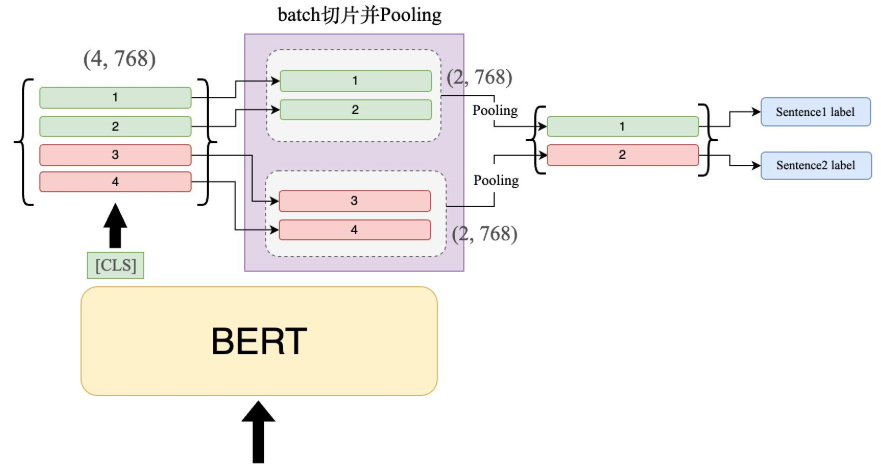
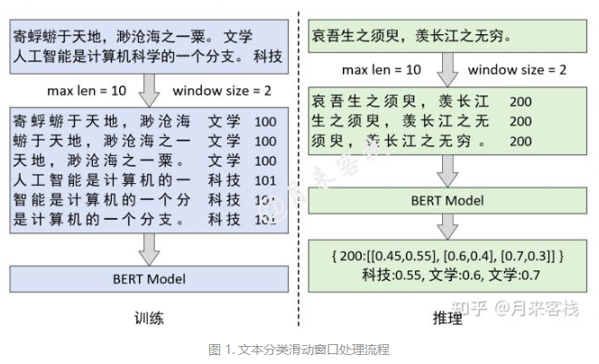

# 【关于BERT如何处理篇章级长文本】那些你不知道的事

> 作者：杨夕
> 
> 论文学习项目地址：https://github.com/km1994/nlp_paper_study
> 
> 《NLP 百面百搭》地址：https://github.com/km1994/NLP-Interview-Notes
> 
> 个人介绍：大佬们好，我叫杨夕，该项目主要是本人在研读顶会论文和复现经典论文过程中，所见、所思、所想、所闻，可能存在一些理解错误，希望大佬们多多指正。
> 


> NLP && 推荐学习群【人数满了，加微信 blqkm601】


- [【关于BERT如何处理篇章级长文本】那些你不知道的事](#关于bert如何处理篇章级长文本那些你不知道的事)
  - [一、动机](#一动机)
  - [二、为什么 Bert 不能 处理 长文本？](#二为什么-bert-不能-处理-长文本)
  - [三、解决方法](#三解决方法)
    - [3.1 处理方法](#31-处理方法)
    - [3.2 从 消除限制角度 处理](#32-从-消除限制角度-处理)
      - [3.2.1 从 消除限制角度 处理 思路？](#321-从-消除限制角度-处理-思路)
      - [3.2.2 从 消除限制角度 处理 如何处理？](#322-从-消除限制角度-处理-如何处理)
    - [3.3 从 语料角度 处理](#33-从-语料角度-处理)
      - [3.2.1 从 语料角度 处理 思路？](#321-从-语料角度-处理-思路)
      - [3.2.2 从 语料角度 处理 如何处理？](#322-从-语料角度-处理-如何处理)
        - [3.2.2.1 Clipping（截断法）](#3221-clipping截断法)
          - [3.2.2.1.1 Clipping（截断法）分类](#32211-clipping截断法分类)
          - [3.2.2.1.2 Clipping（截断法） 如何选择](#32212-clipping截断法-如何选择)
          - [3.2.2.1.3 Clipping（截断法） 存在什么问题？](#32213-clipping截断法-存在什么问题)
        - [3.2.2.2 Pooling（池化法）【注：引用至 何枝】](#3222-pooling池化法注引用至-何枝)
          - [3.2.2.2.1 Pooling（池化法）是什么？](#32221-pooling池化法是什么)
          - [3.2.2.2.2 Pooling（池化法）思路？](#32222-pooling池化法思路)
          - [3.2.2.2.3 Pooling（池化法）实战？](#32223-pooling池化法实战)
          - [3.2.2.2.4 Pooling（池化法）缺点？](#32224-pooling池化法缺点)
        - [3.2.2.3 划窗法](#3223-划窗法)
          - [3.2.2.3.1 划窗法 思路介绍](#32231-划窗法-思路介绍)
          - [3.2.2.3.2 划窗法 代码 实战](#32232-划窗法-代码-实战)
          - [3.2.2.3.3 划窗法 缺点](#32233-划窗法-缺点)
        - [3.2.2.4 压缩法](#3224-压缩法)
          - [3.2.2.4.1 压缩法 动机](#32241-压缩法-动机)
          - [3.2.2.4.2 如何筛选出有效句子？](#32242-如何筛选出有效句子)
        - [3.2.2.5 RNN（循环法）](#3225-rnn循环法)
          - [3.2.2.5.1 RNN（循环法）思路](#32251-rnn循环法思路)
    - [3.4 从 模型角度 处理](#34-从-模型角度-处理)
      - [3.4.1 从 模型角度 处理 介绍](#341-从-模型角度-处理-介绍)
      - [3.4.2 从 模型角度 处理 模型思路介绍](#342-从-模型角度-处理-模型思路介绍)
  - [参考](#参考)


## 一、动机

1. BERT，即 Transformers 的双向编码器表示，目前是公众可以使用的最著名的预训练语言模型之一。事实证明，它在包括问答和分类在内的各种任务中非常有用；
2. BERT 最多只能接受长度为 512 个标记的输入序列。这是一个很大的限制，因为许多常见的文档类型都比 512 个单词长得多。在这一点上，我们将解释和比较一些方法来克服这个限制，并使您更容易使用 BERT 处理更长的输入文档。

## 二、为什么 Bert 不能 处理 长文本？

BERT 和长输入文档的问题源于 BERT 架构的几个领域：

1. Transformer 本身是自回归的，BERT 的创建者指出，当使用超过 512 个令牌的文档时，性能会显着下降。所以，这个限制是为了防止低质量的输出;


2. 自注意力模型的空间复杂度为 O(n²)。像这样的二次复杂性使得这些模式非常耗费资源进行微调。输入的时间越长，微调模型所需的资源就越多。二次复杂度使大多数用户的成本高得令人望而却步;
3. 最最本质的原因还是在于BERT中的Positional Embedding和Transformer中的Positional Embedding实现方式并不一样，后者是通过公式(1)计算得到，而前者本质上则是一个可学习的参数，也就是说每个位置所对应的向量就类似于Token Embedding中每个词对应的词向量。因此，在 使用 Bert 时，自然就不能够随意的修改这个词表的长度。


> Positional Embedding 代码

```s
class PositionalEmbedding(nn.Module):
    """
    位置编码。
    *** 注意： Bert中的位置编码完全不同于Transformer中的位置编码，
                前者本质上也是一个普通的Embedding层，而后者是通过公式计算得到，
                而这也是为什么Bert只能接受长度为512字符的原因，因为位置编码的最大size为512 ***
    # Since the position embedding table is a learned variable, we create it
    # using a (long) sequence length `max_position_embeddings`. The actual
    # sequence length might be shorter than this, for faster training of
    # tasks that do not have long sequences.
                                                 ————————  GoogleResearch
    https://github.com/google-research/bert/blob/eedf5716ce1268e56f0a50264a88cafad334ac61/modeling.py
    """

def __init__(self, hidden_size, max_position_embeddings=512, initializer_range=0.02):
    super(PositionalEmbedding, self).__init__()
    self.embedding = nn.Embedding(max_position_embeddings, hidden_size)      
    
def forward(self, position_ids):
    """
    :param position_ids: [1,position_ids_len]
    :return: [position_ids_len, 1, hidden_size]
    """
    return self.embedding(position_ids).transpose(0, 1)
```

所以，除非是己从零开始训练一个 Bert 预训练模型，否则如果你使用的是谷歌开源的预训练模型，那么这个词表的大小将会被限制在512。 当然，我们依旧可以突破这个限制，那就是重新初始化Positional Embedding中的向量，并将前512个向量用已有的进行替换，超出部分就使用随机初始化的权重在语料上进行微调或训练。

## 三、解决方法

### 3.1 处理方法

处理方法可以分三种：

1. 从 消除限制角度 处理；
2. 从 语料角度 处理；
3. 从 模型角度 处理；

### 3.2 从 消除限制角度 处理

#### 3.2.1 从 消除限制角度 处理 思路？

如果需要消除长度限制，办法之一便是重新初始化一个更大的位置词表，然后将前512个向量用预训练模型中的进行替换，余下的通过在下游任务中微调或语料中训练得到即可。

#### 3.2.2 从 消除限制角度 处理 如何处理？

在载入预训练模型的方法中进行修改即可。如下所示便是载入预训练模型的方法：

```s
    @classmethod
    def from_pretrained(cls, config, pretrained_model_dir=None):
        ### 载入本地的模型参数 begin ###
        model = cls(config)  # 初始化模型，cls为未实例化的对象，即一个未实例化的BertModel对象
        pretrained_model_path = os.path.join(pretrained_model_dir, "pytorch_model.bin")
        if not os.path.exists(pretrained_model_path):
            raise ValueError(f"<路径：{pretrained_model_path} 中的模型不存在，请仔细检查！>")
        loaded_paras = torch.load(pretrained_model_path)
        state_dict = deepcopy(model.state_dict())
        loaded_paras_names = list(loaded_paras.keys())[:-8]
        model_paras_names = list(state_dict.keys())[1:]
        ### 载入本地的模型参数 end ###
        ### 将载入的模型参数赋值赋值到现有的模型 begin ###
        for i in range(len(loaded_paras_names)):
            # 判断当前参数是否为positional embeding层，如果是进行替换即可
            if "position_embeddings" in model_paras_names[i]:
                ### 这部分代码用来消除预训练模型只能输入小于512个字符的限制 begin ###
                if config.max_position_embeddings > 512:
                    new_embedding = replace_512_position(state_dict[model_paras_names[i]],
                                                         loaded_paras[loaded_paras_names[i]])
                    state_dict[model_paras_names[i]] = new_embedding
                ### 这部分代码用来消除预训练模型只能输入小于512个字符的限制 begin ###
            else:
                state_dict[model_paras_names[i]] = loaded_paras[loaded_paras_names[i]]
            logging.debug(f"## 成功将参数:{loaded_paras_names[i]}赋值给{model_paras_names[i]},"
                          f"参数形状为:{state_dict[model_paras_names[i]].size()}")       
        model.load_state_dict(state_dict)
        ### 将载入的模型参数赋值赋值到现有的模型 end ###
        return model
```

看完之后 是不是 觉得 很简单粗暴。


### 3.3 从 语料角度 处理

#### 3.2.1 从 语料角度 处理 思路？

从 语料角度 处理 思路 很简单，就是 采用某些手段 来 修改原始的输入序列，让他的长度 尽可能小于 512 的最大长度，使其满足 Bert 的 输入范式。

常用的方法：

1. Clipping（截断法）：将序列长度超过512的部分直接去掉保留前512个Token或者后512个Token；
2. Pooling（池化法）：截断法最大的问题在于需要丢掉一部分文本信息，如果我们能够保留文本中的所有信息，想办法让模型能够接收文本中的全部信息，这样就能避免文本丢失带来的影响；
3. 划窗法：主要见于诸阅读理解任务（如Stanford的SQuAD)。Sliding Window即把文档分成有重叠的若干段，然后每一段都当作独立的文档送入BERT进行处理。最后再对于这些独立文档得到的结果进行整合；
4. 压缩法；
5. RNN（循环法）：BERT之所以会有最大长度的限制，是因为其在进行MLM预训练的时候就规定了最大的输入长度，而对于类RNN的网络来讲则不会有句子长度的限制（有多少个token就过多少次NN就行了）。但RNN相较于 Transformer 来讲最大问题就在于效果不好；

#### 3.2.2 从 语料角度 处理 如何处理？

##### 3.2.2.1 Clipping（截断法）

###### 3.2.2.1.1 Clipping（截断法）分类

Clipping（截断法） 是 最简单暴力的方法，主要包含以下几种：

1. head截断：head截断即从文本开头直到限制的字数；
2. tail截断：tail截断是从结尾开始往前截断；
3. head+tail 截断：head+tail 截断，开头和结尾各保留一部分，比例参数是一个可以调节超参数；

> 注：输入 最长序列字数是512，其中还包括一些特殊token，在文本分类中，要包含开头的[CLS]和结尾的[SEP]，因此实际只能最多装510个字。

###### 3.2.2.1.2 Clipping（截断法） 如何选择

因为 有三种 Clipping（截断法）方式，那么在实际场景下，该如何选择？

如果一个长文本的重要信息是在开头，可能head截断效果是比tail截断要好。同理，tail截断对信息点在结尾的长文本效果较好。具体哪种截断效果好，不同数据集不一样，需要多试。使用head+tail 截断，一般而言是好于单一的截断方式。

###### 3.2.2.1.3 Clipping（截断法） 存在什么问题？

Clipping（截断法） 虽然简单粗暴，但是 问题也很明显，那就是容易 丢失序列信息。一般使用在文本不是特别长的场景。如果是篇章级，文本长度好几千，如果直接使用截断法，必然会丢失大量信息。因此面对这种场景，首先想到的是“拆”。

##### 3.2.2.2 Pooling（池化法）【注：引用至 [何枝](https://www.zhihu.com/question/327450789/answer/2455518614)】

###### 3.2.2.2.1 Pooling（池化法）是什么？

- Pooling（池化法） 介绍

在做 CV 任务的时候，我们通常会在卷积层（Conv）后接一层 Pooling 层，用一个区域内最重要的特征值来代替整个区域的特征值，从而实现数据降维的功能，这个过程也被称为下采样（down sampling）。

- 长文档 如何进行 Pooling（池化法）？

在 长文档 用sliding window切片，独立放进去BERT得到cls的表示，所有cls再进行融合。

- Pooling（池化法） 方法 介绍

探索了四种融合方式：

1. max pooling
2. avg pooling
3. simple attetnion
4. Transformer

最后一个是最好的，总而言之，Transformer over Transformer。这样做的好处是模型是端到端训练的，没有信息损失，但前提是GPU的显存够大，48G的GPU只能设置batch size 2, TPU v3的话batch size可以开到32...

###### 3.2.2.2.2 Pooling（池化法）思路？

假设 有 2 句 1000 个 token 的句子，那么我们怎么处理呢？

1. 需要先将这 2 个句子切成 4 段（第 1 个句子的 2 段 + 第 2 个句子的 2 段），并放到一个 batch 的输入中喂给模型


> 注：引用至 [何枝](https://www.zhihu.com/question/327450789/answer/2455518614)

2. Pooling（池化法）

当切完片后的数据喂给 BERT 后，我们取 BERT 模型的 [CLS] 的输出，此时输出维度应该为：(4, 768) 。随即，我们需要将这 4 个 output 按照所属句子分组，由下图所示，前 2 个向量属于一个句子，因此我们将它们归为一组，此时的维度变化：(4, 768) -> (2, 2, 768)。接着，我们对同一组的向量进行 Pooling 操作，使其下采样为 1 维的向量，即（1, 768）。这里 Pooling（池化法） 有两种 Pooling（池化法）方式：Max-Pooling 和 Avg-Pooling


> Pooling示意图，BERT输出维度（4, 768） 注：引用至 [何枝](https://www.zhihu.com/question/327450789/answer/2455518614)

3. Pooling（池化法）结果 参与 分类

在完成 Pooling 任务后，我们得到了每个输入句子的表征向量了（2, 768），之后流程就和普通的分类任务一样，将各句子对应的表征向量过一个 FC，通过 softmax 得到句子标签即可。

###### 3.2.2.2.3 Pooling（池化法）实战？

1. 分割 长文本

由于每一段长文本需要被切割为若干个子段，所以我们重写一个针对长文本切分的dataloader，每次调用该加载器时，能够自动返回被切分好的子句列表。

```s
class LongTextDataloader(object):

    def __init__(self, filename: str, max_sub_sentence_len: int, batch_size: int, 
                    shuffle=False):
        """
        长文本dataloader，初始化函数。

        Args:
            filename (str): 数据集文件
            max_sub_sentence_len (int): 每个子句最大的长度限制
            batch_size (int): 一次返回多少句子
            shuffle (bool): 是否打乱数据集
        """
        self.texts, self.labels = self.__read_file(filename)
        assert len(self.texts) == len(self.labels), '[ERROR] texts count not equal label count.'
        self.start = 0
        self.end = len(self.texts)
        self.batch_size = batch_size
        self.max_sub_sentence_len = max_sub_sentence_len
        self.visit_order = [i for i in range(self.end)]
        if shuffle:
            random.shuffle(self.visit_order)
    
    def __read_file(self, filename: str) -> tuple:
        """
        将本地数据集读到数据加载器中。

        Args:
            filename (str): 数据集文件名

        Returns:
            [tuple] -> 文本列表，标签列表
        """
        texts, labels = [], []
        with open(filename, 'r', encoding='utf8') as f:
            for line in f.readlines():
                label, text = line.strip().split('\t')
                texts.append(text)
                labels.append(label)
        return texts, labels

    def __split_long_text(self, text: str) -> list:
        """
        用于迭代器返回数据样本的时候将长文本切割为若干条。

        Args:
            text (str): 长文本, e.g. -> "我爱中国"
        
        Returns:
            [list] -> ["我爱", "中国"]（假设self.max_sub_sentence_len = 2）
        """
        sub_texts, start, length = [], 0, len(text)
        while start < length:
            sub_texts.append(text[start: start + self.max_sub_sentence_len])
            start += self.max_sub_sentence_len
        return sub_texts
    
    def __next__(self) -> dict:
        """
        迭代器，每次返回数据集中的一个样本，返回样本前会先将长文本切割为若干个短句子。

        Raises:
            StopIteration: [description]

        Returns:
            [dict] -> {
                'text': [sub_sentence 1, sub_sentence 2, ...],
                'label': 1
            }
        """
        if self.start < self.end:
            ret = self.start
            batch_end = ret + self.batch_size
            self.start += self.batch_size
            currents = self.visit_order[ret: batch_end]
            return {'text': [self.__split_long_text(self.texts[c]) for c in currents], 'label': [int(self.labels[c]) for c in currents]}
        else:
            self.start = 0
            raise StopIteration
    
    def __iter__(self):
        return self

    def __len__(self) -> int:
        return len(self.labels)
```

2. Pooling（池化法）

Pooling 方法的关键核心就在于 batch 的维度的转换，这里给出模型的 forward 代码，包含了如何将子句聚合并 Pooling 的操作。代码如下：

```s
def forward(self, sub_texts: list, max_seq_len: int):
        """
        正向传播函数，将一段长文本中的所有N段子文本都过一遍backbone，得到N个pooled_output([CLS]过了一个tanh函数)，
        再将这N个pooled_output向量Pooling成一个768-dim的融合向量，融合向量中768-dim中的每一维都取这N个向量对应dim
        的最大值（MaxPooling），使用MaxPooling而非MeanPooling是因为BERT类的模型抽取的特征非常稀疏，Max-Pooling
        会保留突出的特征，Mean-Pooling会将特征拉平。

        Args:
            sub_texts (list[str]): batch个长文本被切成的所有子段列表 -> (batch, sub_text_num, sub_text_len)
            max_seq_len (int): tokenize之后的最大长度（文本长度+2）
        """
        sub_inputs = []
        for sub_text in sub_texts:                                                  # 一个batch的句子
            sub_idx = 0
            for sub in sub_text:                                                    # 一个句子中的子句
                if sub_idx == self.max_sub_sentence_num:                            # 若达到最大子句数，则丢掉剩余的子句
                    break
                encoded_inputs = self.tokenizer(text=sub, max_seq_len=max_seq_len)
                input_ids = encoded_inputs["input_ids"]
                token_type_ids = encoded_inputs["token_type_ids"]
                sub_inputs.append([input_ids, token_type_ids])
                sub_idx += 1
            while sub_idx < self.max_sub_sentence_num:                              # 若未达到最大子句数，则用空句子填满
                sub_inputs.append([[], []])
                sub_idx += 1

        sub_inputs = Tuple(                                                         # (batch*max_sub_setences, seq_len)
            Pad(axis=0, pad_val=self.tokenizer.pad_token_id),                       # input
            Pad(axis=0, pad_val=self.tokenizer.pad_token_type_id)                   # segment
        )(sub_inputs)

        input_ids, token_type_ids = sub_inputs                                      # (batch*max_sub_setences, seq_len)
        input_ids, token_type_ids = paddle.to_tensor(input_ids), paddle.to_tensor(token_type_ids)
        
        sequence_output, pooled_output= self.backbone(input_ids, token_type_ids)    # sequence_output: (batch*max_sub_setences, seq_len, cls-dim)
                                                                                    # pooled_output: (batch*max_sub_setences, cls-dim)

        pooled_output = paddle.reshape(pooled_output, (-1, 1, self.max_sub_sentence_num, 768))  # (batch, 1, max_sub_setences, cls-dim)
        pooled = F.adaptive_max_pool2d(pooled_output, output_size=(1, 768)).squeeze()       # (batch, cls-dim)
        # pooled = F.adaptive_avg_pool2d(pooled_output, output_size=(1, 768)).squeeze()     # (batch, cls-dim)

        fc_out = self.fc(pooled)
        fc_out = self.activation(fc_out)
        output = self.output_layer(fc_out)                                          # (batch, 2)

        return output
```

3. Pooling（池化法） 做分类

```s
for epoch in range(1, args.epochs + 1):
        for step, batch in enumerate(train_data_loader, start=1):
            sub_texts, labels = batch['text'], batch['label']
            labels = paddle.to_tensor(labels)                   # (batch, 1)

            logits = model(sub_texts, args.max_seq_length)
            loss = criterion(logits, labels)
            probs = F.softmax(logits, axis=1)
            loss.backward()
            optimizer.step()
            lr_scheduler.step()
            optimizer.clear_grad()

            if global_step % args.valid_steps == 0:
                evaluate(model, criterion, metric, dev_data_loader, global_step)
                tic_train = time.time()
            ……
```

###### 3.2.2.2.4 Pooling（池化法）缺点？

1. 性能较差，原来截断法需要encode一次，Pooling法需要encode多次，篇章越长，速度越慢。
2. segment之间的联系丢失，可能会出badcase。

##### 3.2.2.3 划窗法

###### 3.2.2.3.1 划窗法 思路介绍

1. 切分：将原始样本以滑动窗口的形式进行采样构造得到多个子样本；
2. 训练模型：然后将这些子样本作为训练集来训练模型；
3. 推理：在推理阶段通过 BERT 运行每个段，以获得分类 logits；
4. 通过组合投票（每段一个），我们可以得到一个平均值，我们将其作为最终分类。


> 引用至: [月来客栈](https://www.zhihu.com/question/327450789/answer/2501360257)

整体的处理流程，其中左边为训练部分，右边为推理部分。在模型训练阶段时，需要先将每个原始样本按照固定长度和窗口进行滑动得到相应的子样本。例如图1左边的原始样本“寄蜉蝣于天地，渺沧海之一粟”就重构成了3个子样本，并且标签也同原始样本。同时，为了区分不同原始样本之间的子样本，在构造子样本时还分别加上了原始样本对应的ID。最后，将所有原始样本构造得到的子样本作为训练集来训练模型即可。在推理阶段时，对于每个原始样本来说同样要先按照训练集构造时的方式进行处理。在得到多个子样本后再分别将其进行分类并根据样本ID将同一个ID对应的所有分类结果放到一起，最后取概率最大的标签作为原始样本的预测结果即可。

例如图1右边，“哀吾生之须臾，羡长江之无穷”这个原始样本就重构得到了3个子样本，其经过BERT分类模型后3个子样本分别被分进了“科技、文学、文学”这3个类别，最后可直接选择概率值最大的标签（文学:0.7）作为原始样本的预测值。

当然，除此之外你还以将每个子样本对应的前K个概率值最大的预测结果都输出，然后再以集成模型的思想选择最终原始样本的预测结果。例如某个原始样本经过滑动窗口处理后得到了5个子样本，对于每个子样本我们都输出前K个概率值最大的预测结果；然后可以再通过以投票的方式来决定原始样本的预测类别。

###### 3.2.2.3.2 划窗法 代码 实战

> 代码 【引用至: [月来客栈](https://www.zhihu.com/question/327450789/answer/2501360257)】

```s
import numpy as np
np.random.seed(2021)
def data_process(samples, labels, window_size, max_len):
    data = []
    uid = 100
    for sample, label in zip(samples, labels):
        if len(sample) <= max_len:
            data.append([uid, sample, label])
            continue
        s_idx, e_idx = 0, max_len
        while True:
            s = sample[s_idx:e_idx]
            data.append([uid, s, label])
            if e_idx >= len(sample):
                break
            s_idx += window_size
            e_idx += window_size
        uid += 1
    return data

if __name__ == '__main__':
    samples = np.random.randint(0, 100, [5, 20])
    labels = [0, 0, 2, 1, 3]
    print(samples)
    data = data_process(samples, labels,
                        window_size=6,
                        max_len=10)
    print(data)
```


在没有使用滑动窗口处理前，此时samples的输出结果如下所示：

```s
    [[85 57  0 94 86 44 62 91 29 21 93 24 12 70 70 33  7  1 97 26]
    [66 48 99 63 49 16 50 54 52 93  5 49 38 14 71 85 70 41 21 25]
    [10 36 19 57 82 90 15 40 76 53 11 19 33 78 17 89 50  7 27 63]
    [51  9 25 71 84 27 75 27 19 31 50 89 27 18 53 32 20 95 87  3]
    [97 20 18 70 38 90 53 62 93 26 47 91 60  7 93 33 89 37 95 48]]
```

在经过data_process()函数预处理之后则会变成：

```s
    [[100, array([85, 57,  0, 94, 86, 44, 62, 91, 29, 21]), 0], 
    [100, array([62, 91, 29, 21, 93, 24, 12, 70, 70, 33]), 0], 
    [100, array([12, 70, 70, 33,  7,  1, 97, 26]), 0], 
    [101, array([66, 48, 99, 63, 49, 16, 50, 54, 52, 93]), 0], 
    [101, array([50, 54, 52, 93,  5, 49, 38, 14, 71, 85]), 0], 
    [101, array([38, 14, 71, 85, 70, 41, 21, 25]), 0], 
    [102, array([10, 36, 19, 57, 82, 90, 15, 40, 76, 53]), 2], 
    [102, array([15, 40, 76, 53, 11, 19, 33, 78, 17, 89]), 2], ...]
```

###### 3.2.2.3.3 划窗法 缺点

1. 不能在任务上微调 BERT，因为损失是不可微的；
2. 即使存在重叠，您也会错过每个段之间的一些共享信息，这可能会产生特定于分析管道架构的下游影响

##### 3.2.2.4 压缩法

###### 3.2.2.4.1 压缩法 动机

压缩法的宗旨是选取“精华”，去除“糟粕”。断句之后整个篇章分割成segment，通过规则或者训练一个小模型，将无意义的segment进行剔除。

###### 3.2.2.4.2 如何筛选出有效句子？

关键点：如何筛选出有效句子

1. 让正文的句子和标题做字符相似度，只选取字符相似度最大的TOP-K句子来代表这个篇章；
2. 利用 文本摘要方法（TextRank、Tf-idf） 抽取 文章 中 的 主干句; 【注：作者在长文本中用过，效果还行】

> 注：如果压缩之后，大部分的句子还是超过510，继续使用截断法或者Pooling法。

##### 3.2.2.5 RNN（循环法）

###### 3.2.2.5.1 RNN（循环法）思路

1. 句子分割：对数据进行有重叠(overlap)的分割. 这样分割后的每句句子之间仍然保留了一定的关联信息；

```s
def get_split_text(text, split_len=250, overlap_len=50):
	split_text=[]
	for w in range(len(text)//split_len):
  		if w == 0:   #第一次,直接分割长度放进去
    		text_piece = text[:split_len]
  		else:      # 否则, 按照(分割长度-overlap)往后走
  			window = split_len - overlap_len
    		text_piece = [w * window: w * window + split_len]
		split_text.append(text_piece)
	return split_text
```
> 注：设置分割的长度为200, overlap长度为50. 如果实际上线生产确有大量超过500长度的文本, 只需将分割和overlap长度设置更长即可 【参考至：[基于BERT的超长文本分类模型](https://blog.csdn.net/valleria/article/details/105311340)】

2. 利用 Bert 做 特征提取

把分割好后的文本送入BERT进行训练

仍然用[CLS] token作为句子表示. 当然也可以用sequence_output(在我上一个项目FAQ问答的最后结论中, 使用sequence_output的确能比pooled_output效果更好一点)
我们获得的是这样一组数据:

```s
句子1_a的embedding, label
句子1_b的embedding, label
句子1_c的embedding, label
句子2_a的embedding, label
句子2_b的embedding, label
句子3_a的embedding, label
…
```

随后我们把这些embedding拼回起来, 变成了

```s
[句子1_a的embedding,句子1_b的embedding, 句子1_c的embedding], label
[句子2_a的embedding, 句子2_b的embedding], label
[句子3_a的embedding, 句子3_b的embedding], label
```

3. 利用 LSTM + FC 做 分类

将上一步得到的embedding直接送入LSTM网络训练.

### 3.4 从 模型角度 处理

#### 3.4.1 从 模型角度 处理 介绍

从 模型角度 处理，无外乎就是 用 一些其他的模型：

1. XlNet;
2. COGLTX;

#### 3.4.2 从 模型角度 处理 模型思路介绍

1.  XLNet 【注：参考 [【关于 XLNet 】 那些你不知道的事](https://github.com/km1994/nlp_paper_study_bert/tree/master/bert_study/T2_XLNet/)】

- 阅读理由：Bert 问题上的改进
- 动机：
  - Bert 预训练和微调之间的不匹配
  - Bert 的 Max Len 为 512
- 介绍：广义自回归预训练方法
- 思路：
  - 预训练：
    - Permutation Language Modeling【解决Bert 预训练和微调之间的不匹配】
    - Two-Stream Self-Attention for Target-Aware Representations【解决PLM出现的目标预测歧义】 
    - XLNet将最先进的自回归模型Transformer-XL的思想整合到预训练中【解决 Bert 的 Max Len 为 512】
  - 微调：直接利用 特定任务数据 微调

2. CogLTX

- 思路：
  - 采用一个judge模型来判断长文本中哪些句子是重要的，保留下来以后用这些来做下游任务。
  - 其实目前也有先对文本做摘要，然后再做其它任务，但是本文作者将两个任务融合在了一起，一起优化。 
  - 本文的核心就是两部分，judge和reasoner

## 参考

1. [实战中，BERT如何处理篇章级长文本？](https://zhuanlan.zhihu.com/p/88944564)
2. [BERT：如何处理长文档](http://www.gitweixin.com/?p=1663)
3. [基于BERT的超长文本分类模型](https://blog.csdn.net/valleria/article/details/105311340)
